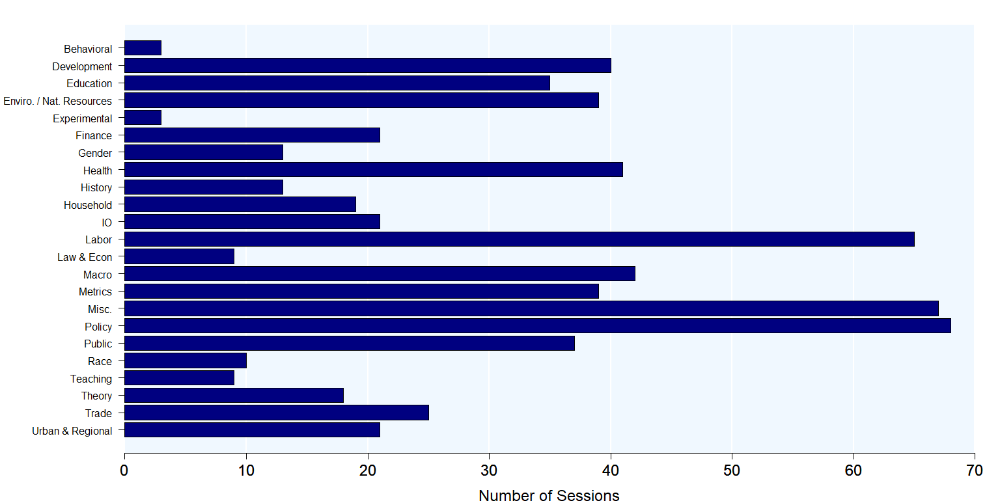

# Searchable SEA Schedule

Overwhelmed by the number of sessions at the Southern Economic Association meeting? Me too.

## The Problem

The [program schedule](https://www.southerneconomic.org/event/7662b305-ad92-474d-8f2c-bce1240b9858/websitePage:efc0c532-2b5f-4374-b1ab-4fae7867ce0b) is not good. The primary issues are:

1. The information in the website it not easily accessible because each session must be manually clicked.
2. There is no way to search for authors by name or affiliation.
3. The filter function only identifies sub-group affiliated sessions.

These become a larger problem when there are 489 sessions in three days.

## An Attempted Solution

[I created an app](https://joshua-c-martin.shinyapps.io/searchable-southerns-schedule/) for filtering through the Southerns schedule. If apps aren't your thing, you can directly download the data [here](https://github.com/joshmartinecon/searchable-southerns-schedule/blob/main/southerns%202023%20schedule.csv).

## Topics

I very crudely attempt to identify the main topic of the session based on the phrases used in the session title. You can find my phrase-to-topic crosswalk [here](https://github.com/joshmartinecon/searchable-southerns-schedule/blob/main/categories.xlsx). Very open to suggestions.

## Web Crawler Code

[My code](https://github.com/joshmartinecon/searchable-southerns-schedule/blob/main/southerns.R) is a mess. Sorry. Reach out if you have questions.

## Shout Out

Special thank you to [Samer Hijjazi](https://www.youtube.com/@SamerHijjazi) for his incredible content on scraping difficult-to-webcrawl websites. If you wish to use my code and are unfamiliar with RSelenium, I highly recommend viewing his content on YouTube first.
